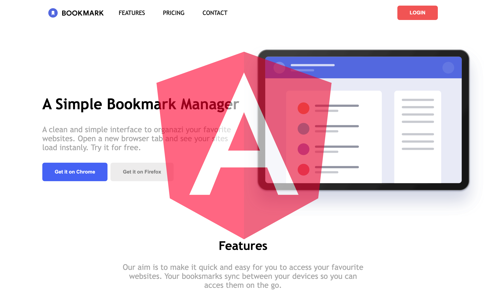

# Angular Bookmark



## Sprint Description

This project was generated using [Angular CLI](https://github.com/angular/angular-cli) version 19.2.8. It is a responsive web application built with Angular, SASS, and TypeScript, replicating the core functionality and layout of a modern bookmarking service.

## Technologies and Tools Used

- **HTML, SASS, TypeScript and Angular**
- **Angular Standalone Components**
- **Angular CLI 19.2.8**
- **Responsive layout with Flexbox**
- **VS Code for development**

## Requirements

- **Modern browser**: Chrome, Firefox, Safari, Edge.
- **Code editor**: VS Code, Sublime Text.
- **Node.js**: Recommended version 18.x or higher
- **Angular CLI**: Must be installed globally

## Developer Prerequisites

To run or contribute to this project, you should have:

- **Basic knowledge of HTML, SASS, TypeScript and Angular.**
- A local development environment with Node.js and Angular CLI installed.

## Getting Started

### 1. Clone the repository

```bash
git clone https://github.com/your-username/angular-bookmark.git
cd angular-bookmark
```

### 2. Install Angular CLI

```bash
npm install -g @angular/cli
```

### 3. Install project dependencies

```bash
npm install
```

### 4. Start the development server

```bash
ng serve -o
```


